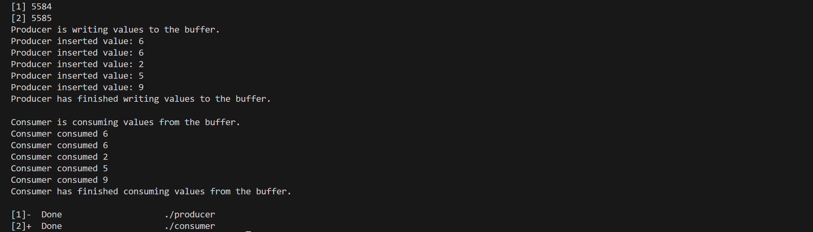
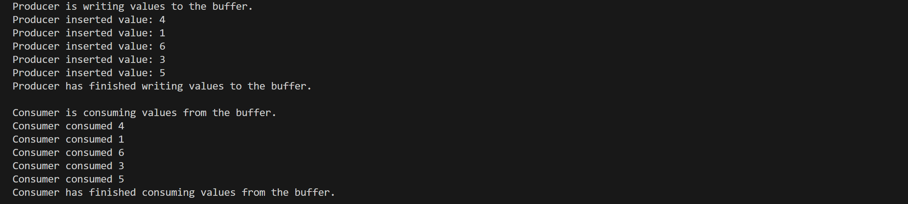
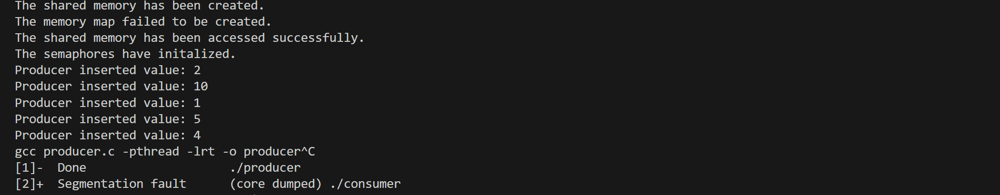

## Example Usage
This implementation of the producer consumer model can be run by three commands 

### Execution and Commands 
```
gcc producer.c -pthread -lrt -o producer
gcc consumer.c -pthread -lrt -o consumer 
```
These commands compile the producer.c and consumer.c files into executables. 

```
./producer & ./consumer &
```
This command runs the two executable files one after another.

### Expected Output
This implementation will write the values of the producer and consumer to the terminal.



Note that integer values vary randomly, and a different set of values will be produced each time. 

 

## Troubleshooting Information 
This implementation depends on the creation of a new memory buffer. If a user runs commands out of order, the shared memory will fail to be created on the next execution of the program. The producer executable will print error messages and then loop infintely, while the consumer executable will return a segmentation fault. 

### Example of Failed Execution 


### Fix
The correct way to fix this issue is to remove current executable files by the rm command.
```
rm producer consumer
```


   
